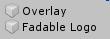
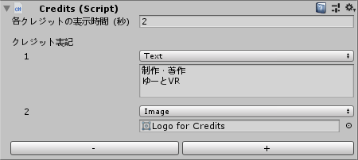

# 分岐型 360 度動画作成 Unity プロジェクト
ユーザーに選択肢を提示する VR 動画作品を作成する Unity プロジェクトのテンプレートです。

Oculus Go をメインターゲットにしていますが、主要なヘッドセットなら大体動くのでは…たぶん。

[サンプル動画](https://twitter.com/yutoVR/status/1084489995367247872?s=20)

## 作り方

2つのシーンで構成されています。これらのシーン内で作業をします。

- Launch … ロードしながら素早い表示を行うためのシーン。ロゴなどを配置。
- Main … 本編を作成するシーン。

### 起動ロゴの変更

Launch シーンを開いて、下記2つのオブジェクトにロゴをセットして下さい。

### 本編の作成

Main シーンを開きます。
Video プレハブを Hierarchy に配置していき、**動画同士の連結を構築**するのが主な作業になります。ドラッグ&ドロップだけで完成するようなっています。

1. 動画を Unity にインポートします。
1. 動画の数だけ Video プレハブを配置します。
1. 動画の設定を行います。    
**再生するビデオ** にビデオファイルをセットし、メッセージと選択肢を設定します。  
動画をどんな順で再生するかの流れを作っていきます。間違えると延々ループする迷いの森もすぐにできますね。  

1. 終着点となる動画では、**次は** オプションを **Credit** にするとエンドクレジット（スタッフロール）が、**End** にすると動画終了後の案内メッセージが表示されます。

### 開始・終了メッセージの変更

Main シーンの Systems 以下にある、**Start と End オブジェクト** が開始・終了時に表示されます。
好きな文章や内容に変更して下さい。

### エンドクレジットの変更

Main シーンの Systems 以下にある、**Credits オブジェクト** にて設定できます。  
下部の + ボタンで数を増やし、テキストまたは画像から選択して設定できます。テキストと画像は好きなだけ組み合わせることができます。  
クレジットが終了すると、終了メッセージが表示されます。

### サウンドの変更

開始前・選択肢場面・終了後の3場面で任意の背景音を流せます。  
Main シーンの Systems 以下にある、**Background Sound** オブジェクトに流したい音声をセットして下さい。

また、特定の選択肢場面で違う音を流したい事があると思います（毛色の変わる時とか）。  
この場合は目的の **Video** オブジェクトに音声をセットして下さい。

ボタンを選ぶ時のポイント・クリック音は、  
Main シーンの Systems 以下にある、**Sound Effects** オブジェクトで変更できます。

## 操作方法

ハンドコントローラーで操作できますが、Unity 上ではキーボードでも操作できるようになっています。

|  | Unity Editor | Oculus Go |
|:------------:|:------------:|:------------:|
| スタート | Enter | トリガー or タッチパッドのクリック |
| 選択肢を選ぶ | 数字キー | トリガー or タッチパッドのクリック |
| 最初に戻る | バックスペース | 戻るボタン |

## メモ

- Windows 上で 4K × 4K（H.264）までの滑らかな再生には [LAV Filters](https://github.com/Nevcairiel/LAVFilters) と Maxwell（9xxシリーズ）以降の GPU が必要になります。
- Windows 上で 8K × 8K（H.265）までの滑らかな再生には [LAV Filters](https://github.com/Nevcairiel/LAVFilters) と Pascal（10xxシリーズ）以降の GPU が必要になります。
- Oculus Go は 4K × 4K までの H.264 を再生できます。

## Special Thanks

**サンプル動画の提供**  
[υμβραν さん](https://twitter.com/Umbrasan) ありがとうございます！

## Licenses

**This Project**  
[MIT License](LICENSE)

**Oculus Integration**  
Copyright © 2014-2017 Oculus VR, LLC. All rights reserved,
